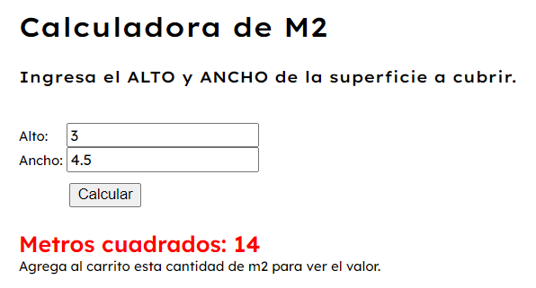

# Calculador m2 html compatible con E-commerce
 ## *Ideal para Tiendas online del estilo de Tiendanube o Wix*
 ---
  Muy simple código para anexar en la descripción de aquellos productos que requieren de este cálculo para saber la cantidad (en unidades) a comprar, sin requerirle al usuario que separa sacar cálculos de superficie.
 
 
 
